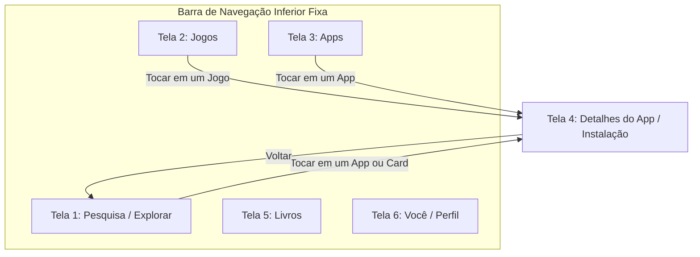

# 📱 Google Play Store Mock • Aplicativo Mobile Híbrido

Projeto prático desenvolvido para a disciplina de **Aplicativos Híbridos** do curso de **Engenharia de Software** — **Universidade de Vassouras**.

Este aplicativo consiste na reprodução em alta fidelidade visual da interface da **Google Play Store**, adotando as diretrizes do **Material Design 3 (Material You Dark Theme)**, navegação por grafo de telas e simulação interativa de 6 telas com React Native e Expo.

---

## 🎯 Objetivo do Projeto

Simular com precisão a experiência de um usuário real na Google Play Store, exercitando os conceitos fundamentais de desenvolvimento híbrido mobile abordados na disciplina:
- **Camadas de Arquitetura:** Apresentação (UI), Estado e Dados.
- **Navegação Declarativa e Grafo de Telas:** Roteamento baseado em arquivos com **Expo Router**.
- **Design Nativo & Componentização:** Tokens de design centralizados, áreas seguras (`SafeAreaView` e `useSafeAreaInsets`) e layout responsivo.
- **Gerenciamento de Recursos:** Componentização com placeholders de imagens, listas virtuais e estados interativos.

---

## 🗺️ As 6 Telas do Aplicativo

O ecossistema do app é estruturado em torno das 5 abas principais da Play Store, integradas a uma tela individual de detalhes do aplicativo:



### Detalhamento das Telas:

| # | Tela | Rota / Arquivo | Descrição e Recursos |
| :-: | :--- | :--- | :--- |
| **1** | **Pesquisa & Explorar** | `src/app/index.tsx` | Barra de busca em cápsula com comando de voz e foto de perfil, grid 2 colunas com 10 categorias de jogos com ícones temáticos, cards patrocinados (Booking.com e Shopee) com notas e tamanhos, e rodapé sempre fixo. |
| **2** | **Jogos (Feed)** | `src/app/jogos.tsx` | Carrossel de jogos em destaque, lista dos "Mais Populares" e "Em Alta", categorias e badges de avaliação. |
| **3** | **Apps (Feed)** | `src/app/apps.tsx` | Vitrine de aplicativos essenciais, produtividade, redes sociais, ferramentas recomendadas e seleções dos editores. |
| **4** | **Detalhes do App** | `src/app/detalhes/[id].tsx` | Página individual de instalação com logotipo, capturas de tela em carrossel horizontal, botão interativo "Instalar" com barra de progresso simulada, resenhas e dados do desenvolvedor. |
| **5** | **Livros (Play Livros)** | `src/app/livros.tsx` | Catálogo de e-books e audiolivros mais vendidos, sinopses e botão de prévia de leitura. |
| **6** | **Você (Perfil & Ajustes)** | `src/app/voce.tsx` | Painel da conta Google com saldo de Play Points, fila de atualizações pendentes, gerenciamento de apps instalados e configurações de segurança. |

---

## 🛠️ Tecnologias e Dependências

- **Framework:** [Expo](https://expo.dev/) (SDK 57)
- **Biblioteca Base:** [React Native](https://reactnative.dev/) (0.86) & [React](https://react.dev/) (19)
- **Roteamento:** [Expo Router](https://docs.expo.dev/router/introduction/) (File-based navigation)
- **Linguagem:** [TypeScript](https://www.typescriptlang.org/) (Tipagem estrita)
- **Ícones & Vetores:** [@expo/vector-icons](https://icons.expo.fyi/) (Ionicons & MaterialCommunityIcons)
- **Tratamento de Áreas Seguras:** `react-native-safe-area-context`
- **Estilização:** `StyleSheet` nativo com paleta Material 3 Dark (`#131314`, `#1F2023`, `#282A2C`, `#004A77`, `#C2E7FF`)

---

## 🚀 Como Executar o Projeto

### Pré-requisitos
- **Node.js** (versão LTS recomendada: 18, 20 ou 22)
- **npm** ou **yarn**
- Aplicativo **Expo Go** instalado no smartphone (opcional, para testes no dispositivo físico)

### 1. Clonar o Repositório e Instalar Dependências
```powershell
git clone https://github.com/pfFabio/trabHibrido.git
cd trabHibrido
npm install
```

### 2. Rodar no Navegador (Web)
```powershell
npm run web
```
> O app abrirá em `http://localhost:8081`. Pressione `F12` no navegador e ative a visão mobile (Responsive / iPhone / Android) para simular o aparelho celular.

### 3. Rodar no Celular Físico (Expo Go)
```powershell
npx expo start
```
> Abra o app **Expo Go** no Android/iOS e aponte a câmera para o QR Code exibido no terminal.

---

## 🏛️ Estrutura de Pastas

```text
trabHibrido/
├── assets/                 # Imagens, ícones e fontes locais
├── src/
│   └── app/                # Rotas e telas gerenciadas pelo Expo Router
│       ├── _layout.tsx     # Layout raiz da Stack de navegação
│       ├── index.tsx       # Tela 1: Pesquisa & Explorar (com rodapé fixo)
│       ├── jogos.tsx       # Tela 2: Feed de Jogos
│       ├── apps.tsx        # Tela 3: Feed de Aplicativos
│       ├── detalhes/
│       │   └── [id].tsx    # Tela 4: Detalhes e Instalação do App
│       ├── livros.tsx      # Tela 5: Play Livros
│       └── voce.tsx        # Tela 6: Perfil do Usuário e Gerenciamento
├── package.json            # Dependências e scripts do projeto
├── tsconfig.json           # Configuração de compilação TypeScript
└── README.md               # Documentação do projeto acadêmico
```

---

## 👥 Integrantes do Grupo

*Engenharia de Software — Universidade de Vassouras*
- **Aluno 1:** [Nome Completo] — Matrícula: [00000000]
- **Aluno 2:** [Nome Completo] — Matrícula: [00000000]
- **Aluno 3:** [Nome Completo] — Matrícula: [00000000]
